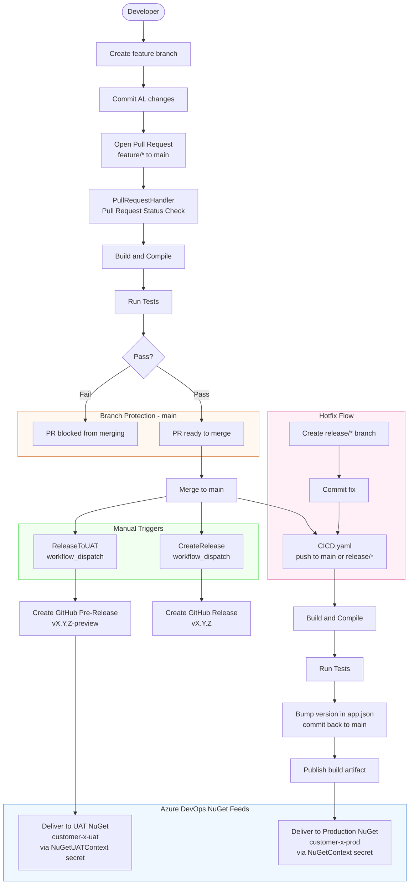

# AL-Go Per Tenant Extension Template

This template repository can be used for managing Per-tenant Extensions (PTEs) for Business Central.

Please go to https://aka.ms/AL-Go to learn more.

# AL-Go Workflow Flow Diagram

## Contributing

Please read [this](https://github.com/microsoft/AL-Go/blob/main/Scenarios/Contribute.md) description on how to contribute to AL-Go for GitHub.

We do not accept Pull Requests on the template repository directly.
